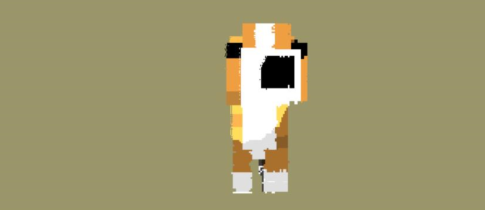

# FPGA Voxel Integer Raytracing



This project aims to accelerate ray tracing using a PYNQ Z1 FPGA. A scene, fitting within a 1024 unit cube coordinate space can be specified within Unity, after which a C# script can be run on the world to produce an equivalent octree representation. The output of this script is parsed into a `.mem` file that can be loaded into the ROM module of the FPGA before bitstream is generated.

Once the `.bit` and `.hwh` files are loaded onto the board, images ray traced images of the scene can be accessed via the GUI. Note this can only be done once the server is running on the board. The following can be controlled via the GUi:
- Camera direction 
- Camera position
- Image background colour
- Preset camera positions.

Currently, `dog.bit` and `dog.hwh` have been added to this repository, these can be loaded onto the board and a ray traced dog can be seen on the GUI.

A complete report for the project can be found [here](report.pdf).

### Repository Structure:
```bash
.
├── README.md
├── gui.py
├── mem-parser.py
├── pynq/
├── report.pdf
├── rtl/
├── server.py
├── software/
└── unity/
```
- `gui.py`: pygame gui used for image visualisation and parameter control
- `mem-parser.py`: parser used to convert C# output to a `.mem` file that can be loaded onto the FPGA.
- `pynq/`: folder containing `.bit` and `.hwh` files to be loaded onto the PYNQ Z1 board
- `rtl/`: folder containing all system verilog files, simulation test bench, `.mem` files.
    - run `./doit.sh` in the `rtl` directory to run the simulation.
- `server.py`: python server to run on the PYNQ board to send images and receive parameters to and from the GUI via TCP.
- `software/`: folder conatining equivalent ray tracing implementations - with and without shading, written in C++ and Python.
- `unity/`: folder containing C# code to produce octress from within Unity.


### Note:
- To view previous versions of files, view the `main` and `testing` branches.
- To see complete testing, and testing of the current `RayTracingUnit` within the provided modules: `pixel_generator.sv` and `packer.sv`, view the test bench located in `simpleRayTracer/testing/`.
